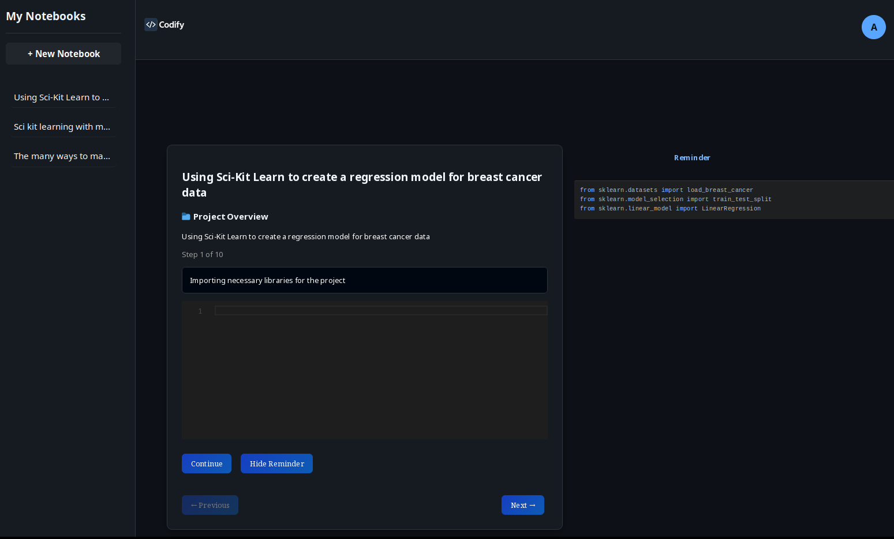

# 🧠 Codify: The Self-Guided Code Learning Platform

Codify is an interactive, memory-reinforcing coding platform that helps learners become fluent in programming by typing out code from memory, one block at a time. The platform uses OpenAI's GPT API to guide users through project-based notebooks, storing progress in Firebase and presenting the experience through a beautiful React.js interface.

## ✨ Features

- 🪄 **AI-Powered Code Walkthroughs**
  Users select a goal (e.g., "Build a To-Do App in React"), and the AI breaks it into sequential code blocks with explanations.

- 🔐 **Authentication System**
  Firebase authentication supports secure login and session tracking.

- 📓 **Notebook System**
  Each coding project is organized into notebooks. Every notebook contains a project description, multiple blocks of code, and AI-generated explanations.

- ⌨️ **Memory-Based Learning Interface**
  Users type each code block from scratch. Progression is only unlocked when typed input exactly matches the reference code.

- 💬 **On-Demand Hints**
  If stuck, users can reveal the correct code as a "reminder," helping them learn without giving up too early.

- ☁️ **Firestore-Backed Storage**
  User notebooks, blocks, and progress are saved to Firestore for persistent learning across sessions.

- 🧪 **Full-Stack Architecture**
  - React.js frontend with Monaco code editor and Tailwind UI
  - Node.js & Express backend with OpenAI API integration
  - Firebase for auth and Firestore database

## 🔧 Tech Stack

- Frontend: React.js, Tailwind CSS, React Router, Monaco Editor
- Backend: Node.js, Express.js, OpenAI API
- Database: Firebase Firestore
- Auth: Firebase Authentication

